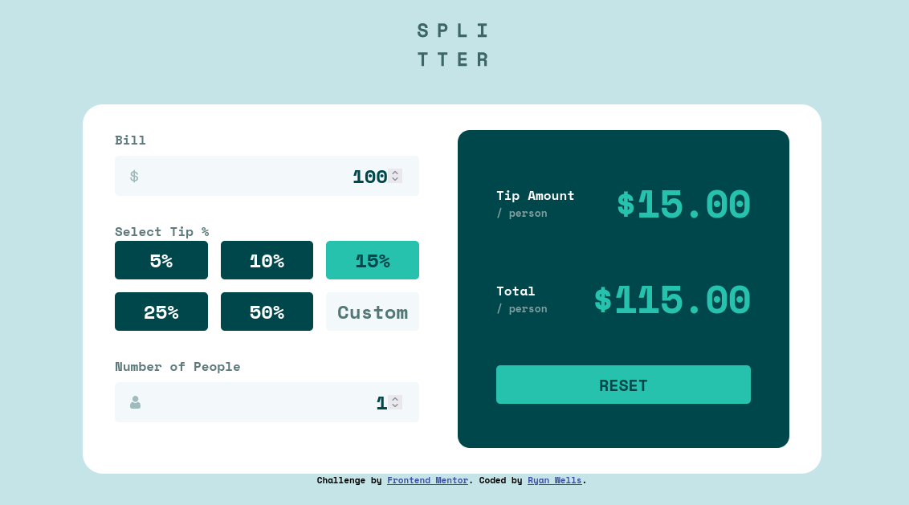

# Frontend Mentor - Tip calculator app solution

This is a solution to the [Tip calculator app challenge on Frontend Mentor](https://www.frontendmentor.io/challenges/tip-calculator-app-ugJNGbJUX). Frontend Mentor challenges help you improve your coding skills by building realistic projects.

## Table of contents

- [Overview](#overview)
  - [The challenge](#the-challenge)
  - [Screenshot](#screenshot)
  - [Links](#links)
- [My process](#my-process)
  - [Built with](#built-with)
  - [What I learned](#what-i-learned)
  - [Continued development](#continued-development)
  - [AI Collaboration](#ai-collaboration)
- [Author](#author)

## Overview

### The challenge

Users should be able to:

- View the optimal layout for the app depending on their device's screen size
- See hover states for all interactive elements on the page
- Calculate the correct tip and total cost of the bill per person

### Screenshot



### Links

- Solution URL: [GitHub](https://github.com/ryanwells-rwc/tip-calculator-app)
- Live Site URL: [Netlify](https://tip-calculator-app-rwc.netlify.app/)

## My process

### Built with

- Semantic HTML5 markup
- Flexbox
- CSS Grid
- Mobile-first workflow
- Vanilla JavaScript

### What I learned

I learned a lot about JavaScript while building this project. I discovered 
that using the `||` operator can help prevent errors when dealing with null or undefined values:

```js
const bill = parseFloat(billInput.value) || 0;
```

I also learned that it can be helpful to exit a function early if a certain condition is met. This can make the code more readable and easier to understand:

```js
// if peopleQuantity is empty show error state and exit function
if (peopleQuantity === '') {
  peopleError.classList.remove('hidden');
  numberOfPeopleContainer.classList.add('border-orange');
  return;
}
```

In SCSS, I learned to use the `not` selector to target elements that do not 
match a certain condition. This can be useful for creating more specific styles and avoiding unnecessary specificity:

```scss
&:not(.no-hover):hover, &:not(.no-hover):focus {
  background-color: $green-200;
  cursor: pointer;
}
```

### Continued development

In the future I plan to start using React for my projects instead of vanilla JavaScript. React provides a more structured and efficient way to build user interfaces, and it has a large community of developers who contribute to its ecosystem.

### AI Collaboration

I used Junie to help me brainstorm some of the solutions for issues that 
came up while working on this project. Since it references the [AGENTS.md](AGENTS.md) file, it is helpful in suggesting ideas without jumping right to 
solutions.

## Author

- Website - [Ryan Wells](https://ryanwells.io)
- Frontend Mentor [@ryanwells-rwc](https://www.frontendmentor.io/profile/ryanwells-rwc)
